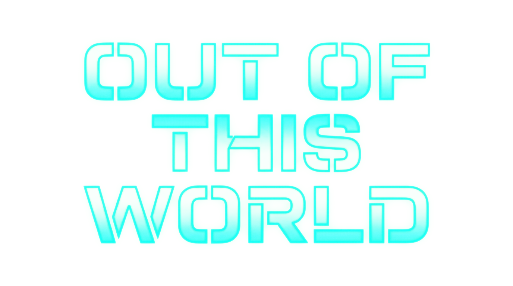

  

# Out of this World for the Sega Saturn

A Sega Saturn port of Eric Chahi's cinematic platformer, <a href='https://en.wikipedia.org/wiki/Another_World_(video_game)'>Out of this World</a>.

## Table of Contents
1. [Overview](#Overview)
1. [About the Game](#About-the-Game)
1. [Setup Instructions](#Setup-Instructions)
1. [Controls](#Controls)
1. [Helpful Game Tips](#Helpful-Game-Tips)
1. [Credits & Special Thanks](#Credits)
1. [Reporting Issues](#Reporting-Issues)
1. [Release Changelog](#Release-Changelog)

## **Overview**

Meet Lester Knight Chaykin. Young physicist, Ferrari owner, and the only man in the building running a particle accelerator in a thunderstorm.

One lightning strike later, he's at the bottom of a pool on an alien planet. Then come the tentacles. Then the beast. Then the guards with the laser pistols...

## 
...And that's the first few minutes of _Out of this World_, the game Eric Chahi built almost single-handed in 1991. It went everywhere except the Saturn. This port runs Fabien Sanglard's `raw`, by way of Gregory Montoir's reimplementation of the original engine, on the Saturn.

What's here:

- The full game, from the PC DOS data
- Save and load from the pause menu, to internal backup memory or a cartridge
- Remappable controls
- A level select for every checkpoint you've reached
- A setup kit that builds the disc for you, no toolchain needed
- `0.bin`, the program on its own (linked at `0x06004000`) for putting it on other discs. [Heart of the Alien](https://github.com/suinevere/heart-of-the-saturn-releases) uses it as Part I.

## **About the Game**

<table>
  <tr>
    <td><strong>Original Title</strong></td>
    <td>Another World</td>
  </tr>
  <tr>
    <td><strong>Localized Title</strong></td>
    <td>Out of this World</td>
  </tr>
  <tr>
    <td><strong>Developer</strong></td>
    <td>Delphine Software (Eric Chahi)</td>
  </tr>
  <tr>
    <td><strong>Publisher</strong></td>
    <td>Delphine Software / Interplay</td>
  </tr>
  <tr>
    <td><strong>Original Release Date</strong></td>
    <td>1991</td>
  </tr>
 </table>

## **Setup Instructions**

No game data is included, and the kit doesn't download any. You need the English PC DOS release: `bank01` through `bank0d` and `memlist.bin`, fourteen files.

1. Download `OOTW-Saturn-<version>.zip` from [Releases](https://github.com/suinevere/out-of-this-saturn-releases/releases) and unzip it
2. Put the fourteen files (any case, loose or in a `.zip`) in the folder named **(put bank and memlist files here)**
3. Run <kbd>run-me.bat</kbd>. Double-click it on Windows, or run `bash run-me.bat` on macOS and Linux (it offers to install `xorriso` if it's missing)
4. Burn or load <kbd>Out of this World (USA)/Out of this World (USA).cue</kbd>

**--> Important! <--**
- Needs about 10 MB free
- Don't unzip the kit under a path with an apostrophe in it. The bundled `xorriso` can't handle it.

## **Controls**

Action, Jump and Run can be moved to A, B, C, X, Y, Z, L or R under **Options → Controls**. Picking a button that's already taken swaps the two. These are the defaults.

### Control Pad ###

<table>
  <tr><td><strong>D-Pad</strong></td><td>Move. Up jumps, Down crouches</td></tr>
  <tr><td><strong>A</strong></td><td>Action: shoot, kick</td></tr>
  <tr><td><strong>B</strong></td><td>Run (hold while walking)</td></tr>
  <tr><td><strong>C</strong></td><td>Jump</td></tr>
  <tr><td><strong>Start</strong></td><td>Pause menu</td></tr>
  <tr><td><strong>A + B + C + Start</strong></td><td>Soft reset</td></tr>
</table>

In menus, **A** or **C** confirms and **B** backs out. In the pause menu, **B** or **Start** resumes. One pad, in port 1.

## **Helpful Game Tips**

- **Start** pauses: resume, save, load, controls, or back to the title. Dying offers to save and carry on.
- There's one save slot, and saving over it asks first.
- Short on backup memory? A screen tells you how many blocks it needs. **A** or **C** plays without saving, **B** goes to the BIOS memory manager.
- On the title screen, **Up Up Down Down Left Right Left Right B A Start** unlocks every checkpoint. Load Game turns into Level Select, and saving is off while it's unlocked.
- Leave the title screen alone for 15 seconds and the demo plays.

## **Credits**

**Special Thanks**
- Eric Chahi, for the game
- Gregory Montoir, for the reimplementation
- Fabien Sanglard, for `raw`, which this port started from
- hkzlab, for the original idea
- ReyeMe and contributors, for SaturnRingLib
- The SegaXtreme forums

GPL-2.0-or-later. The bundled `xorriso` is GPLv3. No game data is distributed.

## **Reporting Issues**

If you find an issue, be it a crash, a freeze or a glitch, please [submit a new issue here](https://github.com/suinevere/out-of-this-saturn-releases/issues/new).

## **Release Changelog**

- **Version 1.0.0 (9/27/2026)**
  - Initial release
